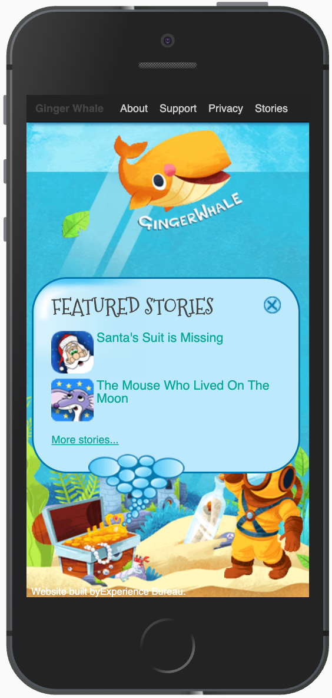
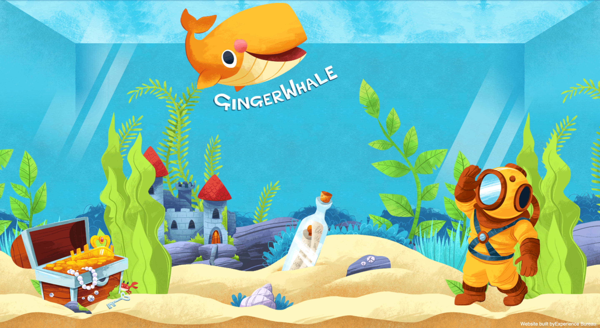
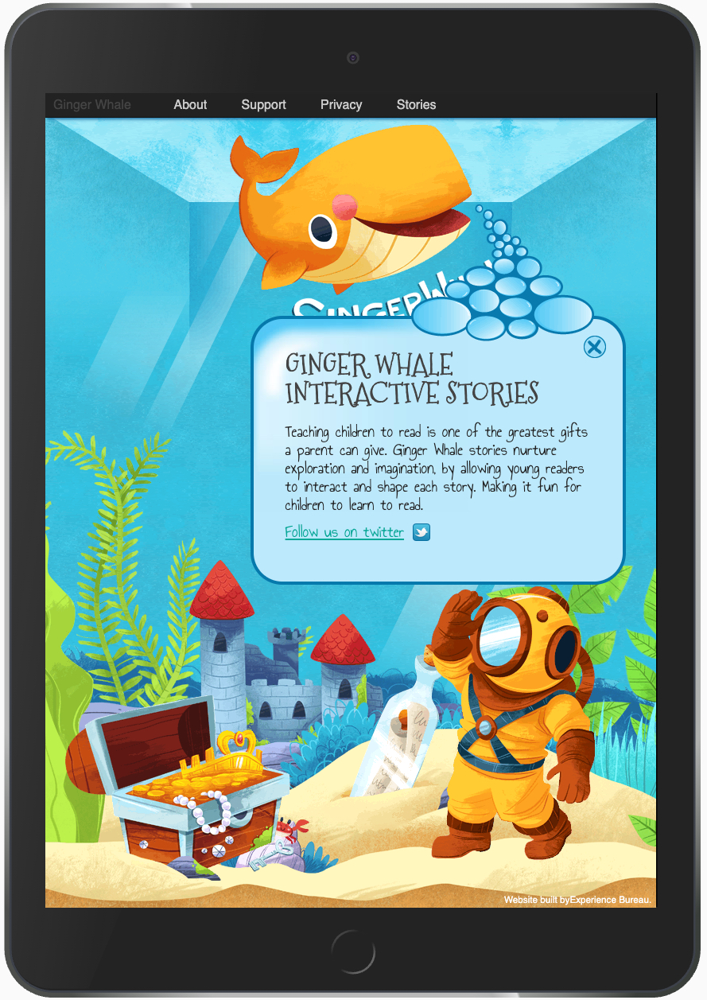
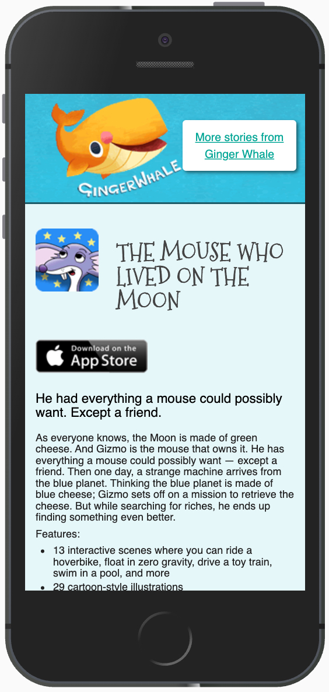

Ginger Whale make beautifully illustrated interactive iPad books for children. Working as Experience Bureau, 
I took the ideas and illustrations for a supporting website and turned them into an animated, fully responsive 
and fun website. 

<Gallery>

</Gallery>

### My contributions

* Design production
* Interaction design
* Web development

### Technology I used

* HTML
* CSS (SASS/Compass)
* JavaScript (including Backbone)
* Adobe CS suite
