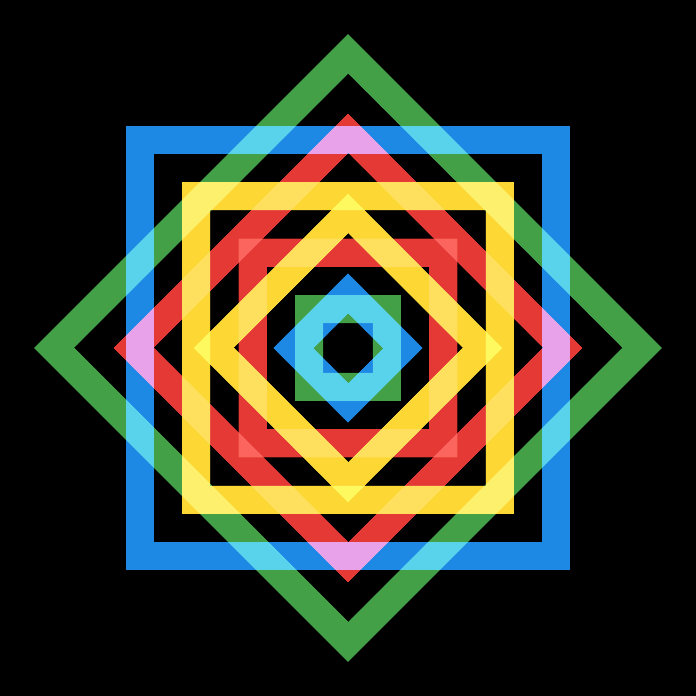
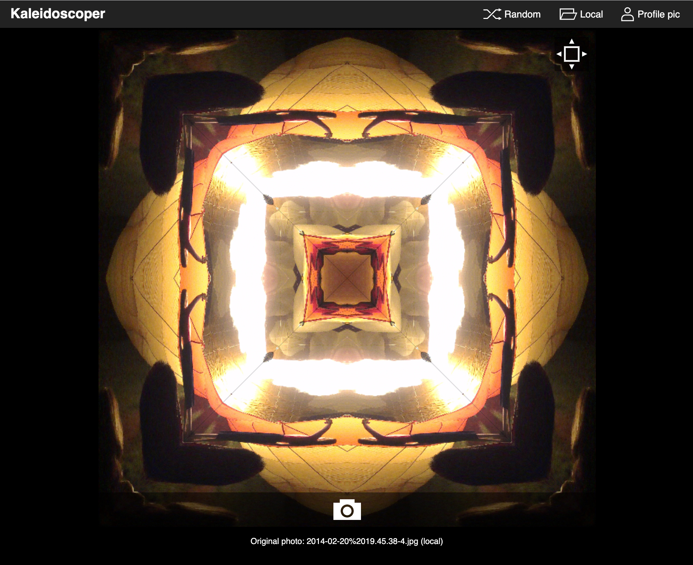
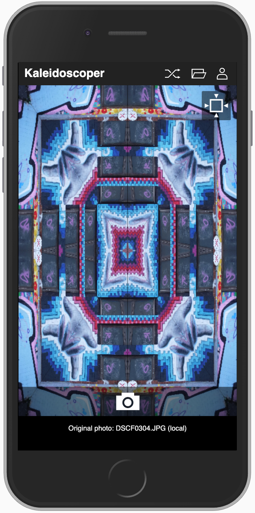
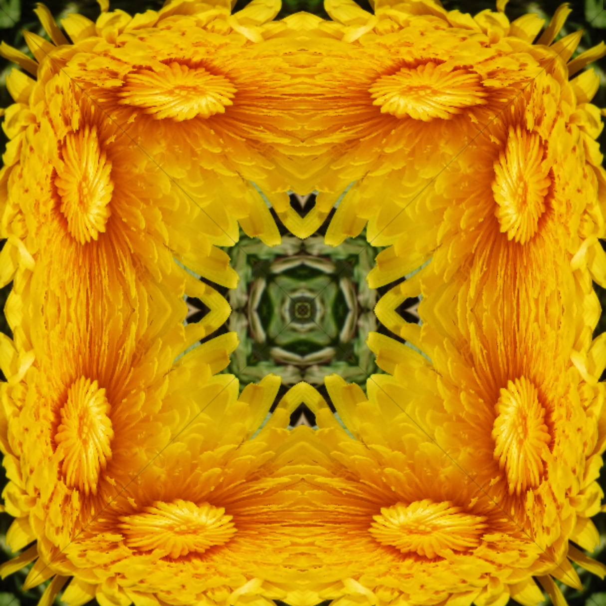

I always wanted a kaleidoscope as a child... so eventually I built one using HTML Canvas. By default, 
Kaleidoscoper takes random public images from Flickr (using their API). You can also load in an image from 
the local file system.

<ProjectLink url="http://kaleidoscoper.com/" />

<Gallery>

</Gallery>

### My contributions

* Initial ideas
* Graphics (icons etc)
* Front-end design and development

### Technology I used

* HTML and CSS
* JavaScript
* Sketch
* Webpack and Babelind

### Next steps...

* Rebuild using React
* Use a more standardised UI
* Allow better integration with the camera etc
* Manage scaling better for a non-square canvas
