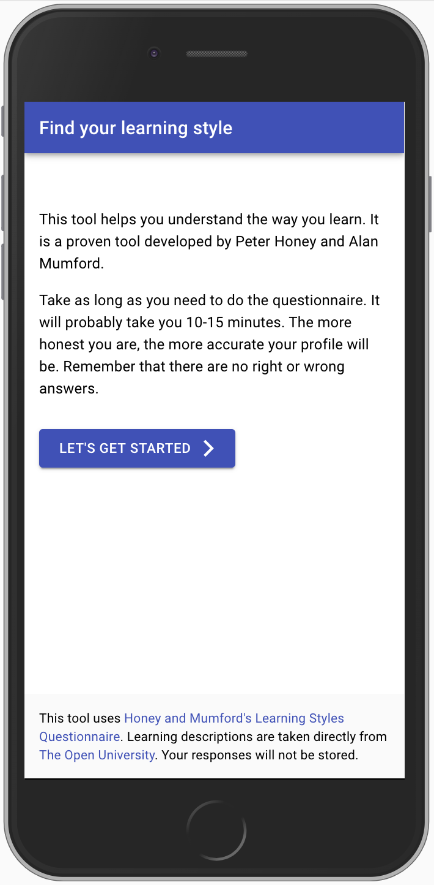
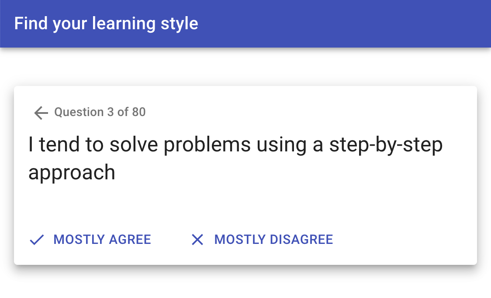
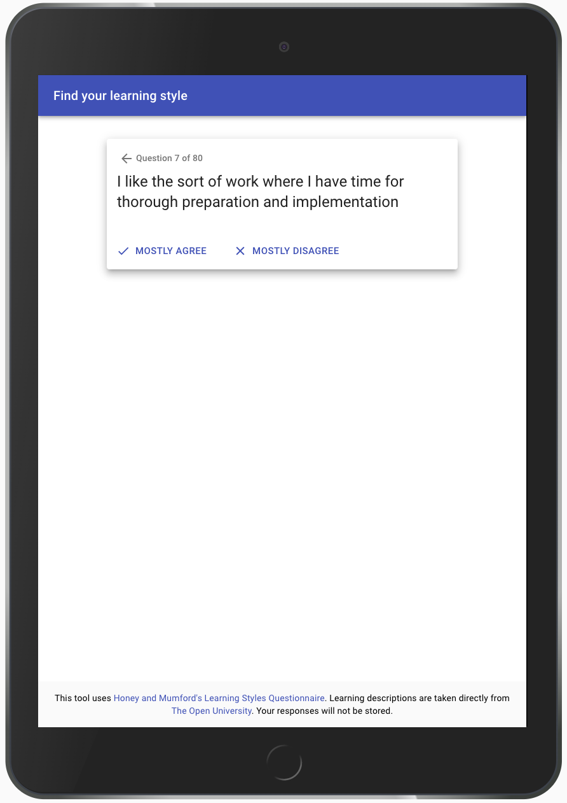
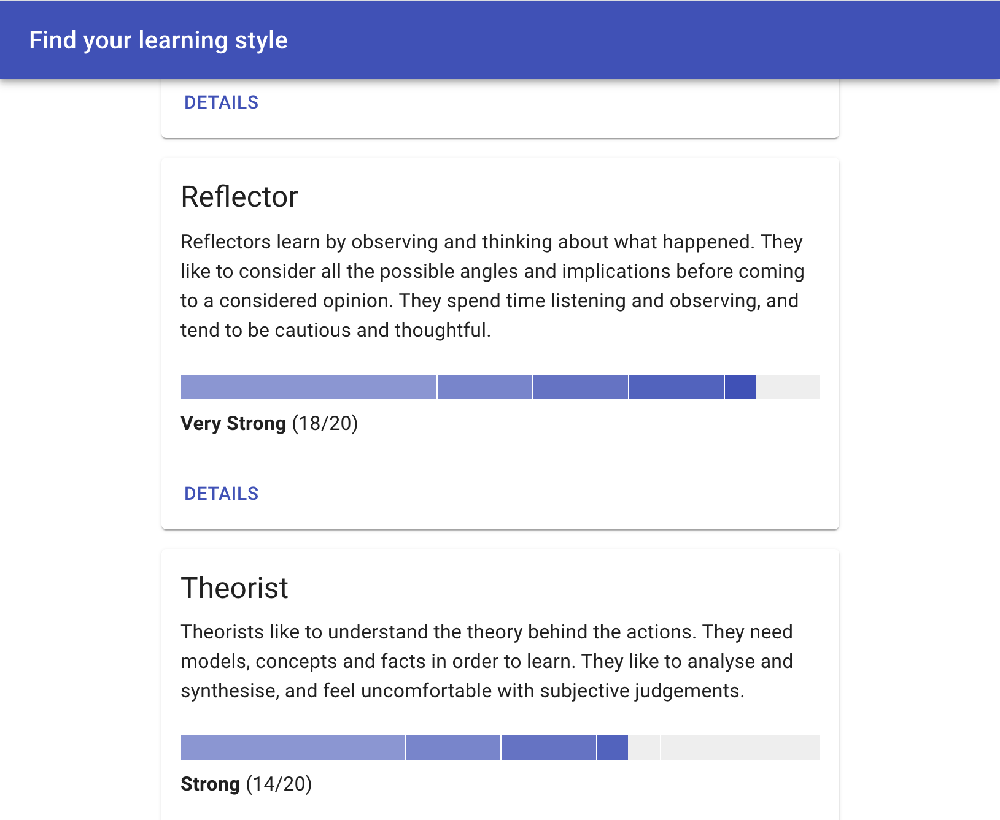

When I was studying a Level 6 Certificate in Counselling and Psychotherapeutic Studies we were presented with
a paper-based version of the Honey and Mumford's Learning Styles Questionnaire. The questionnaire is used for
assessing your learning style. The paper-based version requires a certain amount of manual cross-referencing
in order to derive a score for each learning type. 

I found myself thinking about 
[how the questionnaire might be represented as data](https://github.com/peterchappell/find_your_learning_style/tree/master/src/data) 
and from there it was an enjoyable little project to build a web-based version of the questionnaire using React.

<ProjectLink url="https://peterchappell.github.io/find_your_learning_style" />

<Gallery>

</Gallery>

### Technology

- React
- Material UI Library
- Jest + React Testing Library
- Flow