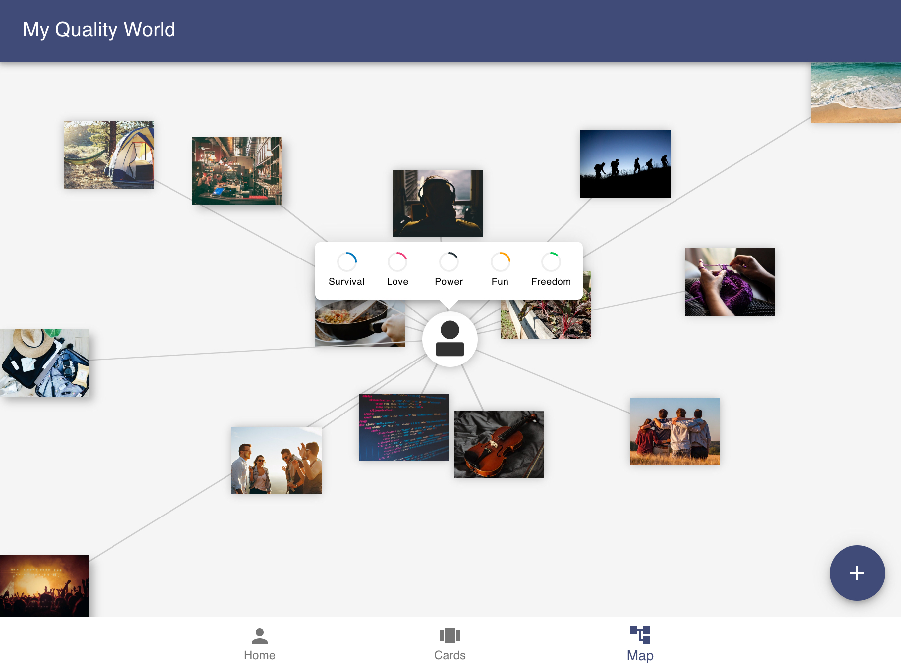
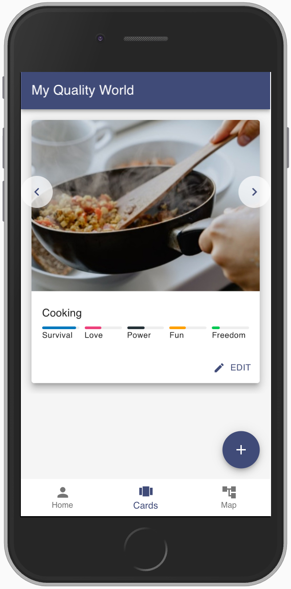
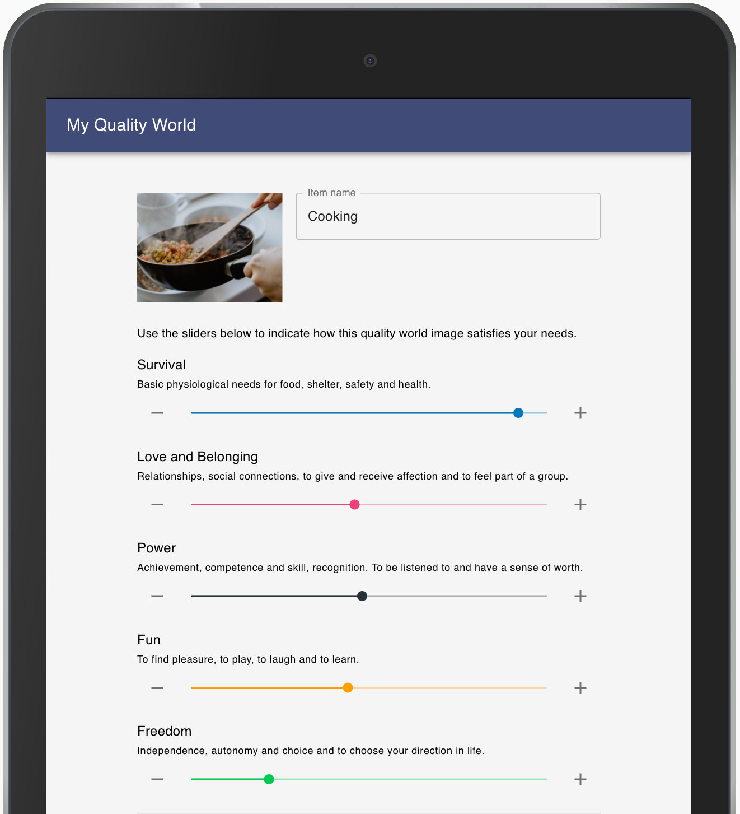
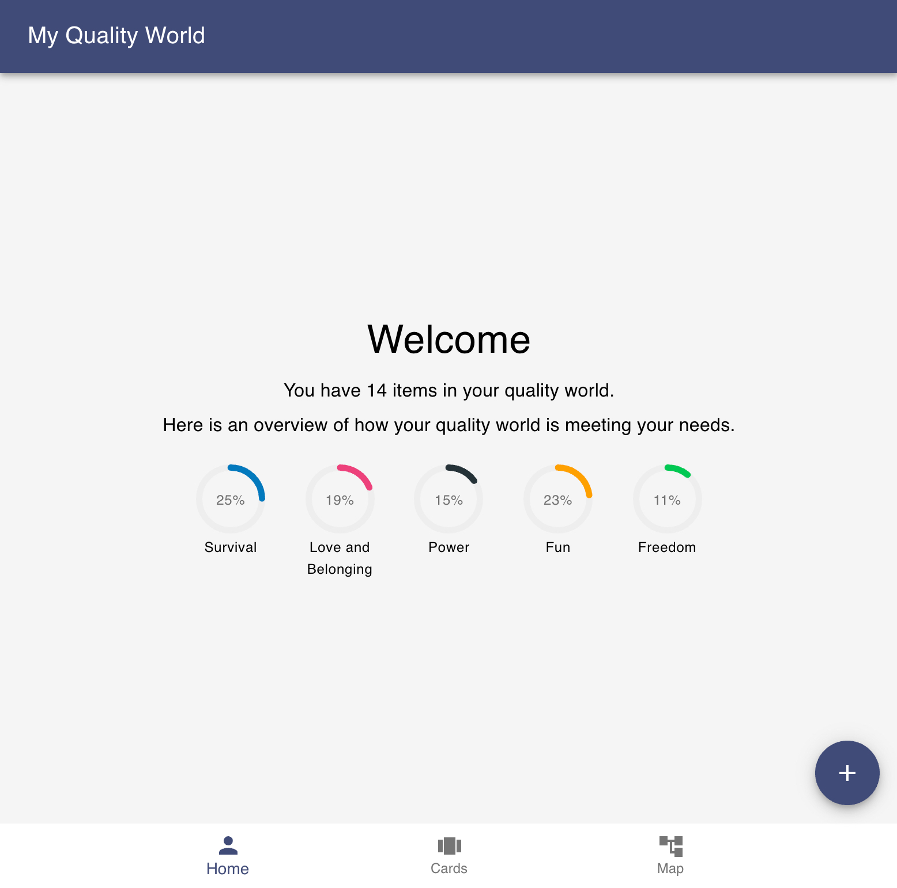
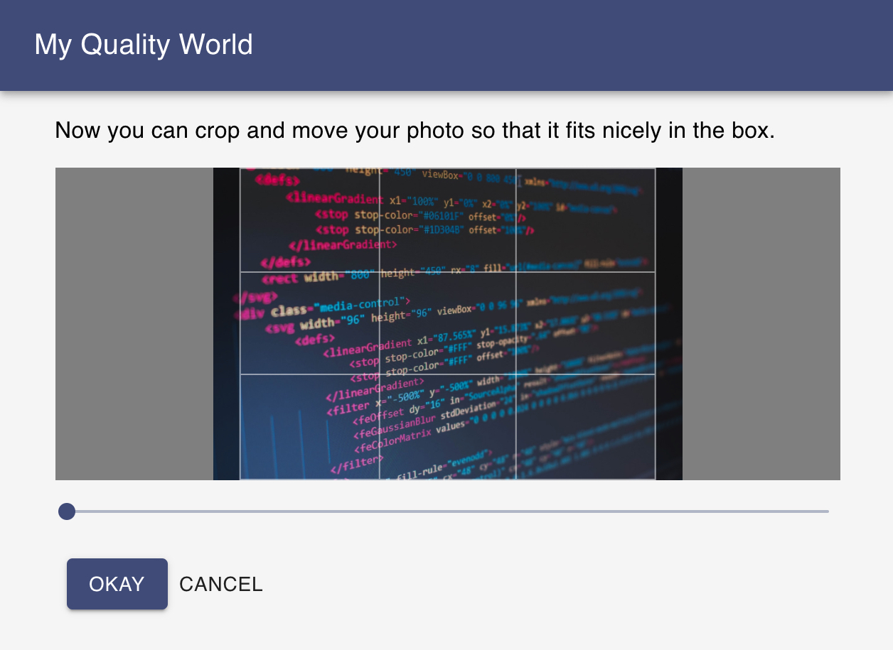

The Quality World is a central idea in William Glasser's Choice Theory (CT) of human behaviour.

<Quote
  attributionText="Bruce Davenport, An Introduction to Choice Theory"
  attributionUrl="https://www.brucedavenport.com/quality-world.html">
Dr. Glasser describes the Quality World as a "personal picture album" of all the people, things, ideas, and ideals that we have discovered increase the quality of our lives.
</Quote>

In Reality Therapy (which uses CT as the basis for therapy), a client is encouraged to draw their quality
world on a sheet of paper. This is typically drawn as a diagram with yourself in the middle and your quality
world pictures spread around you. Pictures close to you are both important and prominent. Pictures that are
further away are still important but might be absent or neglected to some degree in your life at the present
moment. The items in the quality world can change position over time, new items can be added and existing
items can be removed.

Visualising our own quality world in this way provides a useful way of thinking about how our basic needs are
being met. It enables us to think about whether our needs might be better met by "bringing items closer to us"
or by adding new items to our quality world.

I thought it might be interesting to translate the idea of a quality world diagram to an application so I set
about building a proof of concept for the idea.

<ProjectLink url="https://peterchappell.github.io/my-quality-world/" />

<Gallery>

</Gallery>

### Technology

- React
- HTML5 Canvas (using the Konva.js library)
- IndexedDB (via the dexie.js library)
- Material UI Library
- Service Worker
- Progressive Web App (PWA)

### Next steps...

This project could be developed in many ways... A first step will be to do some research and user testing
to assess the viability of the project.

- User testing
- Remote Datbase
  - (as an opt-in since privacy could be a concern)
- Allow sharing of cards
- Add tags to cards
  - Allowing items to be grouped together (e.g. hiking + friends)
- Improve the algorithm for determining how/whether needs are being met
- Improve the map UI
  - Scaling issues need to be sorted
  - Better visualisation
  - Zoom and pan functionality
- Allow drawing of items as well as photos
- Allow URLs for images
  - To allow for google photos, apple photos, stock imagery etc
