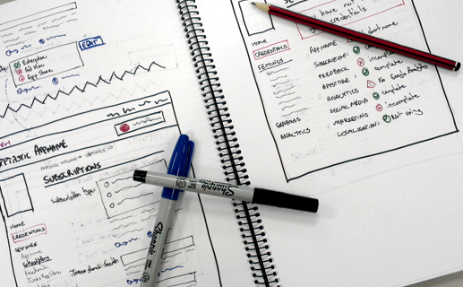
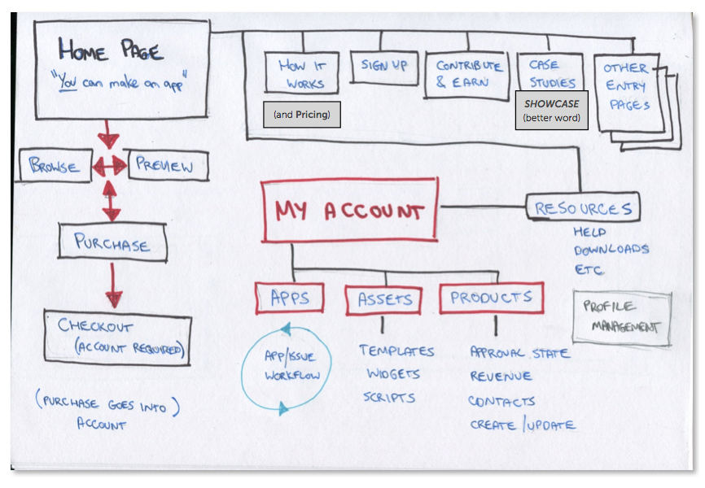
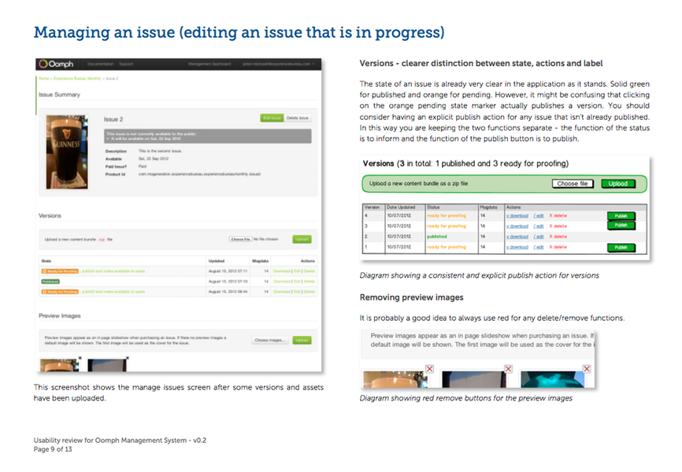

Oomph created a publishing system that made it easy to create iPad apps with engaging content. 
When I was working as Experience Bureau, I provided user experience consultancy services for 
some aspects of the system. 

<Gallery>

</Gallery>

<Quote attributionText="Oomph Chief Technologist">
Just wanted to thank you for the work you did on the report. The guys ... [have] mandated its reading across all the devs! :) They said they really liked the way there are principles they can apply elsewhere. So another big thanks!
</Quote>

### My contributions

* Wireframes
* Style guidelines
* User interface ideas
* Reports

### Technology I used

* Pencils, pens and paper
* Face to face discussions
* Word processor
