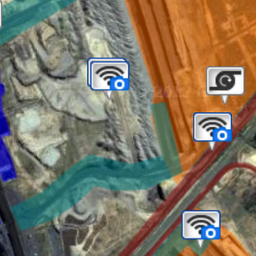
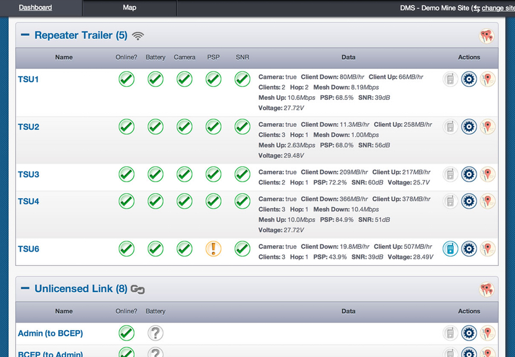
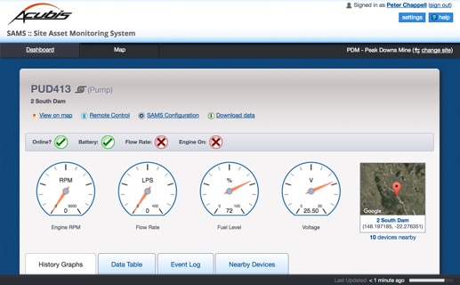

SAMS is a web application used for remotely monitoring and controlling large engineering type devices. 
Much of the application runs as a single page web app that continually and efficiently refreshes data 
without requiring full page reloads. The application works across different browsers on a variety of 
devices, allowing it to be used both in the field and from an office. Working as Experience Bureau, I 
designed the interface and built most of the front-end of the SAMS application.

<Gallery>

</Gallery>

<Quote attributionText="Director of Software Engineering, Acubis">
When we started working on SAMS we had no idea that we’d be able to create something so app-like and user-friendly. It’s clear, fast and it works well on both desktop and mobile devices.
</Quote>

### Features of SAMS

* Single-page app with data updates every minute
* Geolocation (regions, device locations, personal location)
* Smooth app-like layout and transitions
* Fully responsive (mobile to desktop)
* Video camera integration
* Visual representations of device data (graphs, gauges, status indicators etc).

### My contributions

* User interface design
* Interaction design
* Front-end development: JavaScript, HTML5, CSS
* Integration with server-side technology

### Technology I used

* HTML5
* CSS (used compass, scss)
* JavaScript  (including Backbone, JQuery, Underscore and Highcharts)
* Google Maps integration
* Play! framework (Java)
