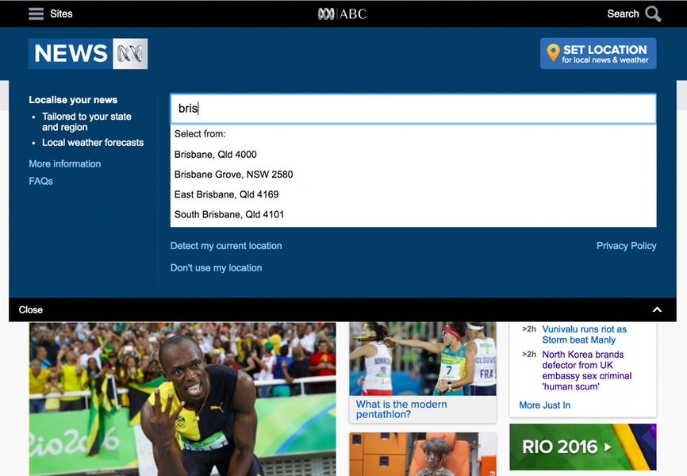
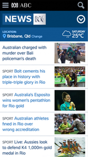
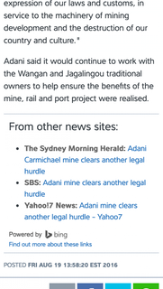
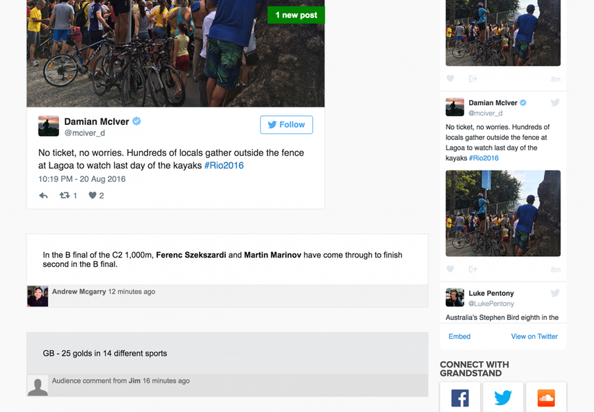

I worked for the Digital News division of the Australian Broadcasting Corporation (ABC) for two and a half 
years. During that time I worked on a variety of projects including localisation of the home page, a 
"from other news sites" module, and a porting of the content across to Apple News. I was also heavily involved
in transitioning the news website to a new templating framework and CMS structure.

<Quote attributionText="Lead Developer, ABC News Online">
    Pete has outstanding technical skills, a great eye for design and is an excellent communicator. 
    Best of all, Pete has the absolute highest level of integrity. Pete is a joy to work with...
</Quote>

<Gallery>

</Gallery>

### Some of the projects I worked on with ABC News

#### Ongoing site maintainence

On a site as big as ABC News there is always a lot of work to do just to keep up with changes in technology and workflows. I helped out with the day to day running of the site as well as making improvements to site speed and page weight, accessibility, development processes, editorial workflow improvements and more.

#### Localisation of the news home page

One of the bigger initiatives on the ABC News website involved integrating local, regional and state news content into the main home page. I built some UI that allows users to set their location. A location section and weather widget is presented in the banner area to confirm the action and provide immediate feedback. Knowing which location is set means that we can then provide a different edition of the main stories on the home page.

#### Apple News

Apple News was released in September 2015. Content produced in the Apple News Format (as opposed to an RSS feed) was more likely to do well - especially in the initial release of the product. I helped work on a solution that creates content bundles (in the Apple News JSON format) as part of the web publishing system. 

#### From other news sites module

In 2014, ABC News Digital introduced a new feature to some of their articles. For some articles, content producers are able to include a “From other news sites” module that lists related stories from other news providers. I helped build a solution that searches other news sites, filters the results and enables them to be added to the bottom of articles when an editor chooses to do so.

#### CMS Transition project

The ABC has a network of sites that were all being gradually migrated over to a single CMS with a 
templating framework. I helped with a "phase 2" upgrade of the templating framework. The ABC DLS 
(Design Language System) was being developed in parallel to the upgrade project so that it could 
eventually be rolled out as a parent theme for all the ABC websites. The input from the DLS project 
(as well as many other ABC-wide initiatives) had to be taken into account throughout the 
transition project.

#### Live blogging system

ABC News used a third party live blogging system. I used the third party's API to build a customised
and embeddable implementation of the live blog. The implementation I developed improved the way
live blogs integrate with the rest of the ABC News website content. 

### My contributions

* Senior developer (team lead on a number of important projects)
* Front-end development 
* Planning and development strategy
* Building services and modules
* Documentation
* Liasing between content and development

### Technology I used

* JavaScript, HTML and CSS
* Node
* Go
* Core Media (CMS)
* Atlassian management tools (Jira, Confluence, Stash)
* Other tools as required