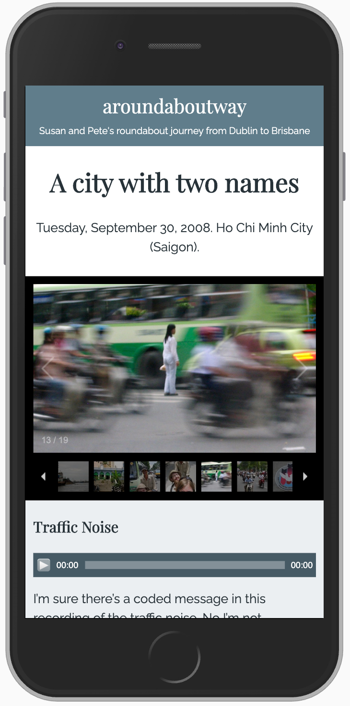
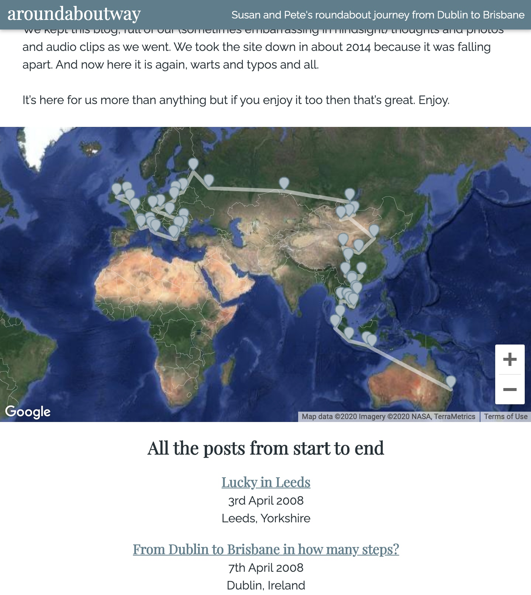
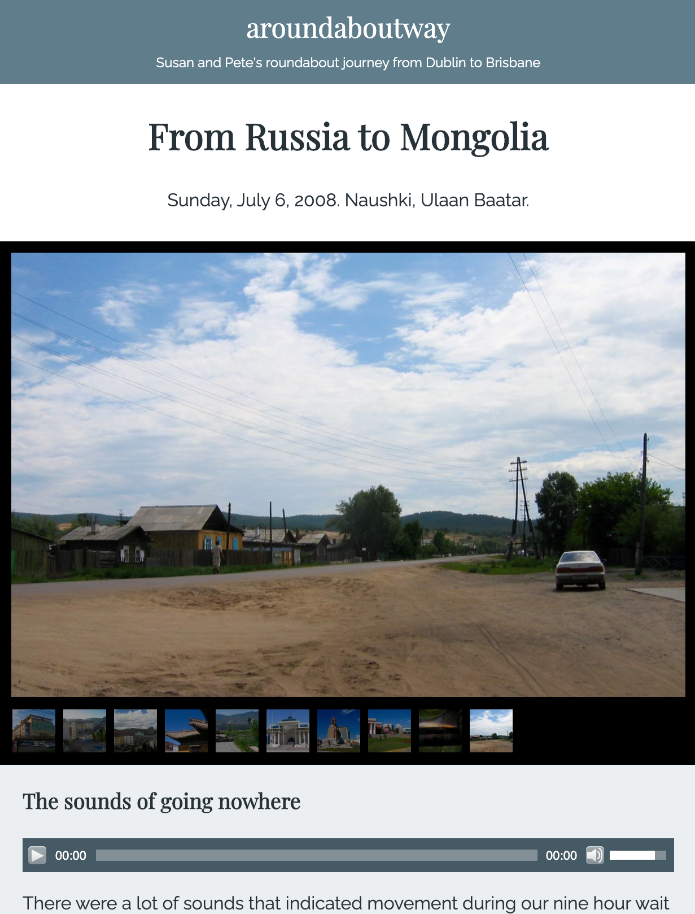
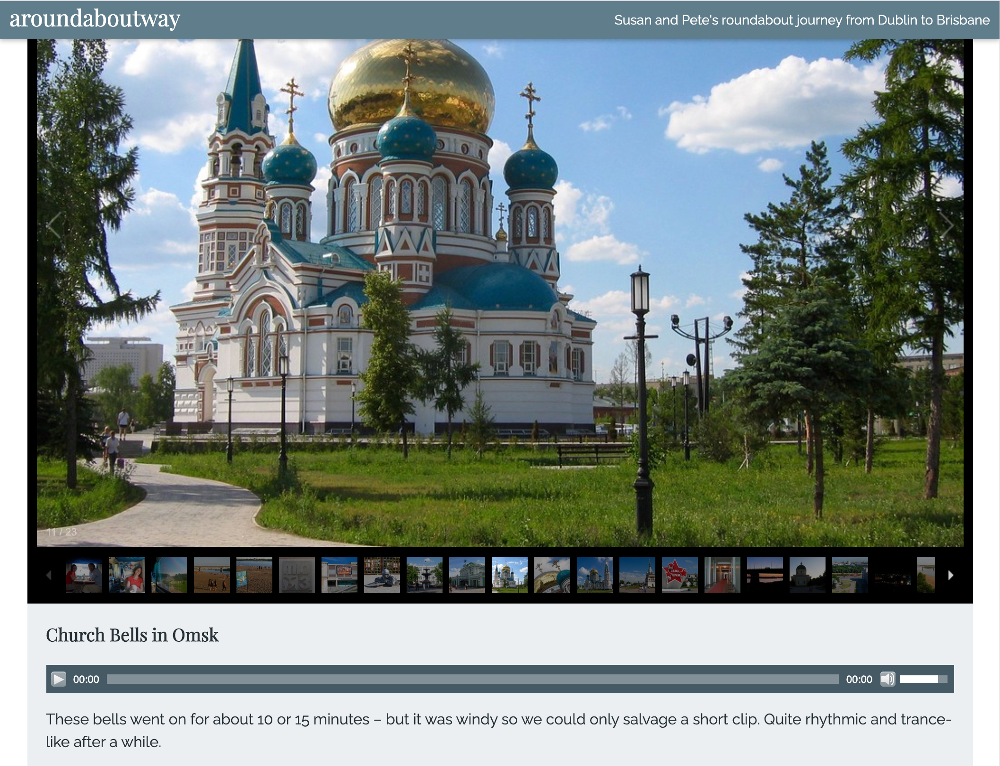

In 2008, my wife and I went on an adventure. We left from Dublin and thought we'd see how far we could get 
without flying. After about eight months we got as far as Bali. 

We kept a blog as we were travelling - full of writing, photos and audio clips. 

<ProjectLink url="http://aroundaboutway.com/" />

<Gallery>

</Gallery>

### My contributions

* Wordpress theme development
* Photography
* Field recording
* Writing
* Budgeting, logistics, keeping my wits about me etc.

### Technology I used

* One of those clumsy tiny netbooks that appeared around 2008
* Dodgy wi-fi connections
* A very not fancy camera
* A field recorder (and then a dictaphone when the field recorder was stolen)
* Wordpress
