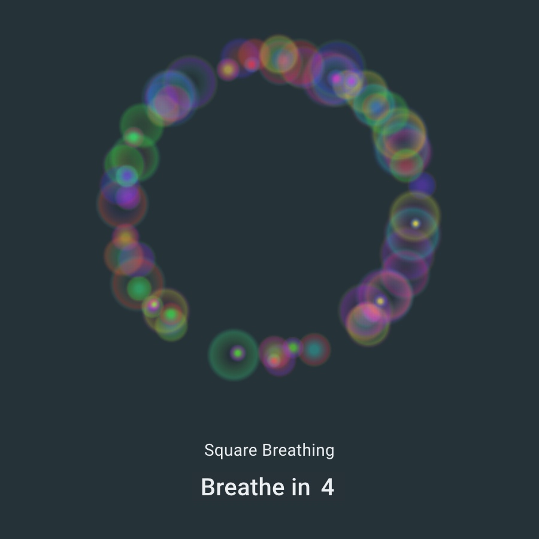
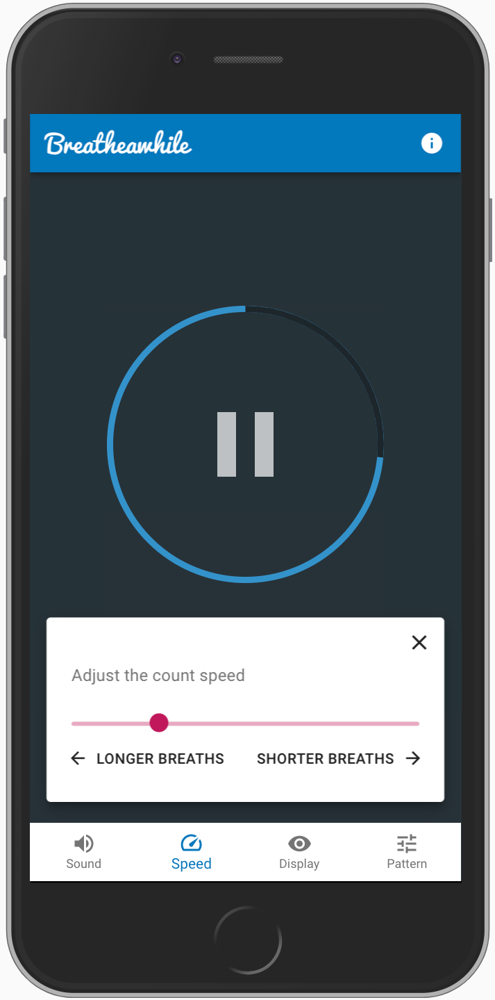
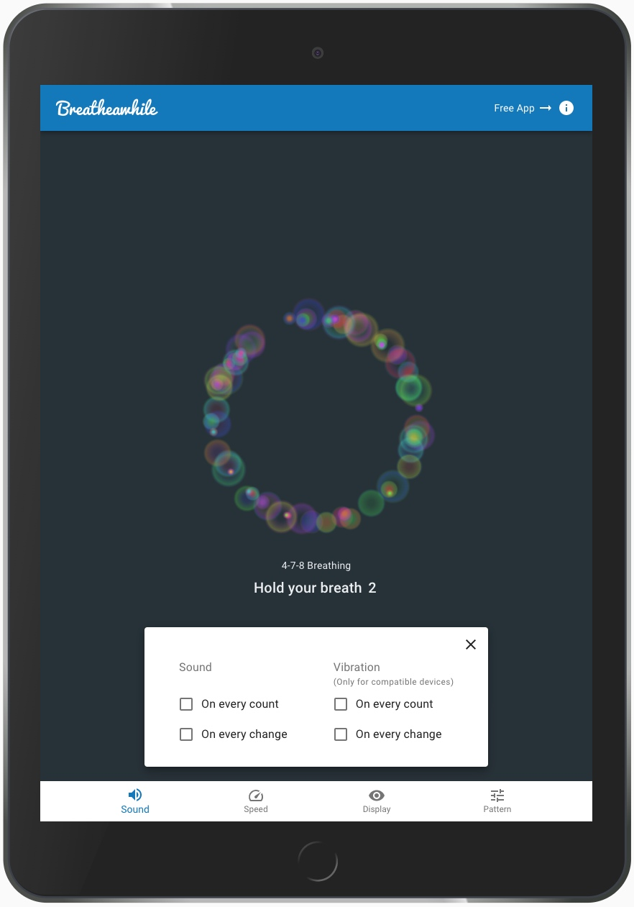
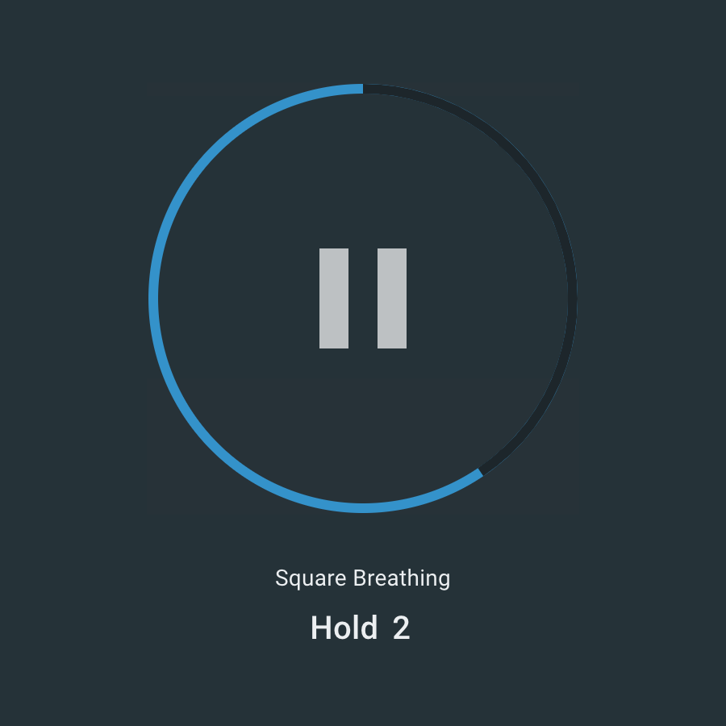

Breathing exercises are a great way to reduce stress and increase mindfulness. Breatheawhile
is a progressive web application (PWA) that provides visual and audio cues to help users 
follow a breathing pattern.

<ProjectLink url="https://breatheawhile.com/" />

<Gallery>

</Gallery>

### Technology

- React
- Material UI Library
- HTML5 Canvas
- AudioContext
- Service Worker
- Progressive Web App (PWA)
- Jest, React Testing Library, Flow

### Next steps...

- Additional visualisations
- Ability to create your own customised breath pattern
- Session timer
  - Select a pattern
  - Select how many cycles in your session
  - Click "start"
  - Count down the cycles and ring an alarm when session is complete
- Session tracker
  - Track sessions over time (on a calendar UI or similar)
