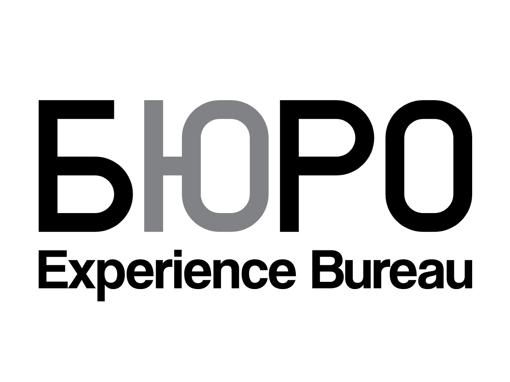
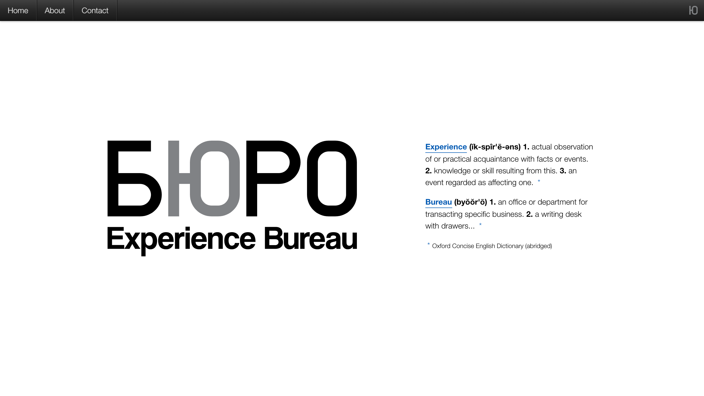
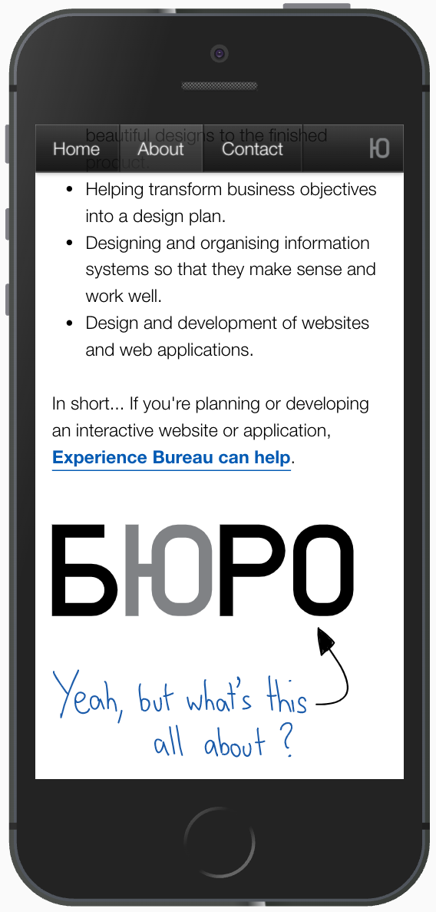

I worked as a freelance developer and designer for a number of years. When I set up the business 
I was working primarily as a UX consultant but more and more I'd stay on to help with front-end
development. I would work with existing tech teams helping to prototype ideas and then take them 
through being to feature complete.

<Gallery>

</Gallery>

### My contributions

* Front-end development
* UX consultancy
* Wireframing and prototyping
* Design services

### Technology I used

* A variety of frameworks including Play (Java), Ruby on Rails, Django and Wordpress
* HTML, CSS and JavaScript (a variety of libraries and frameworks)
* Adobe CS suite
* Paper, pens and anything else I could find
