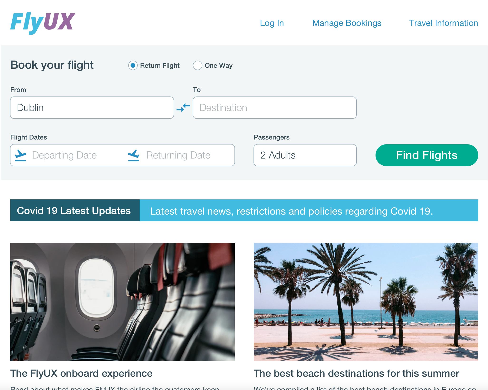
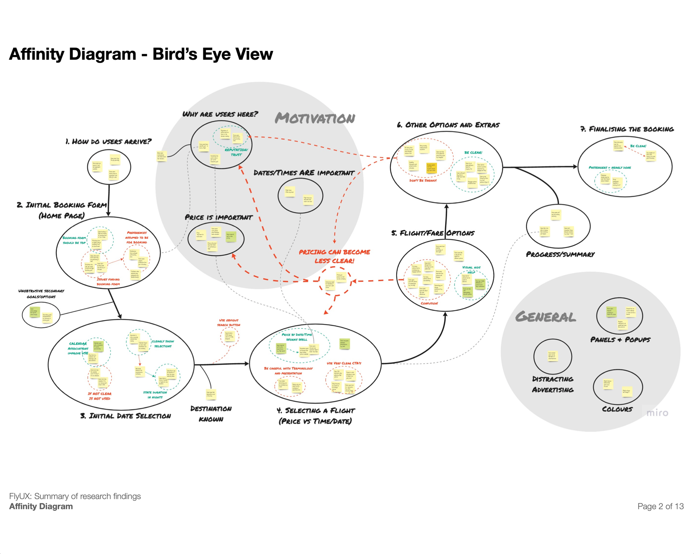
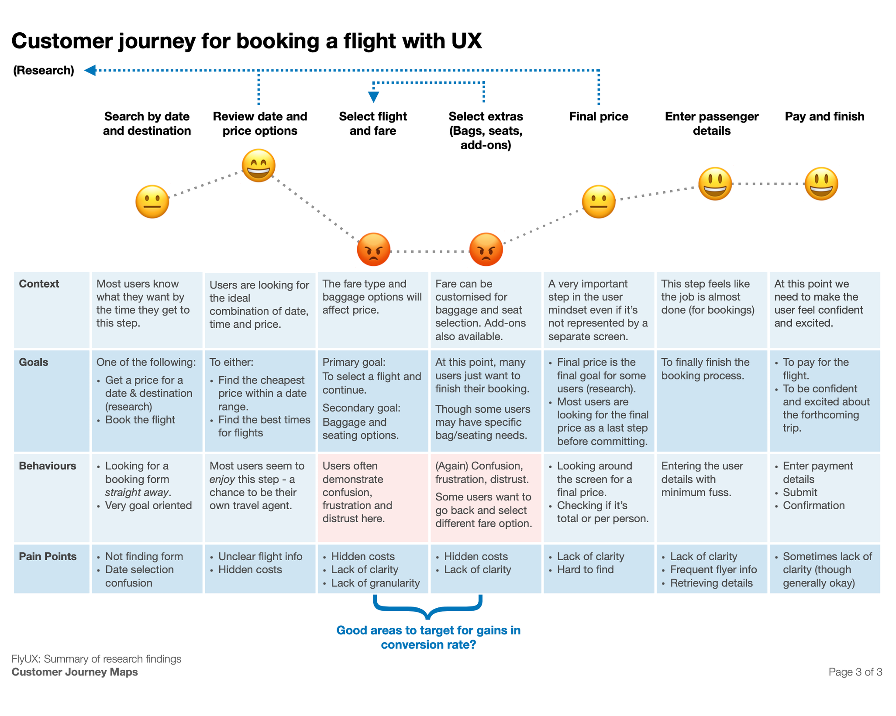
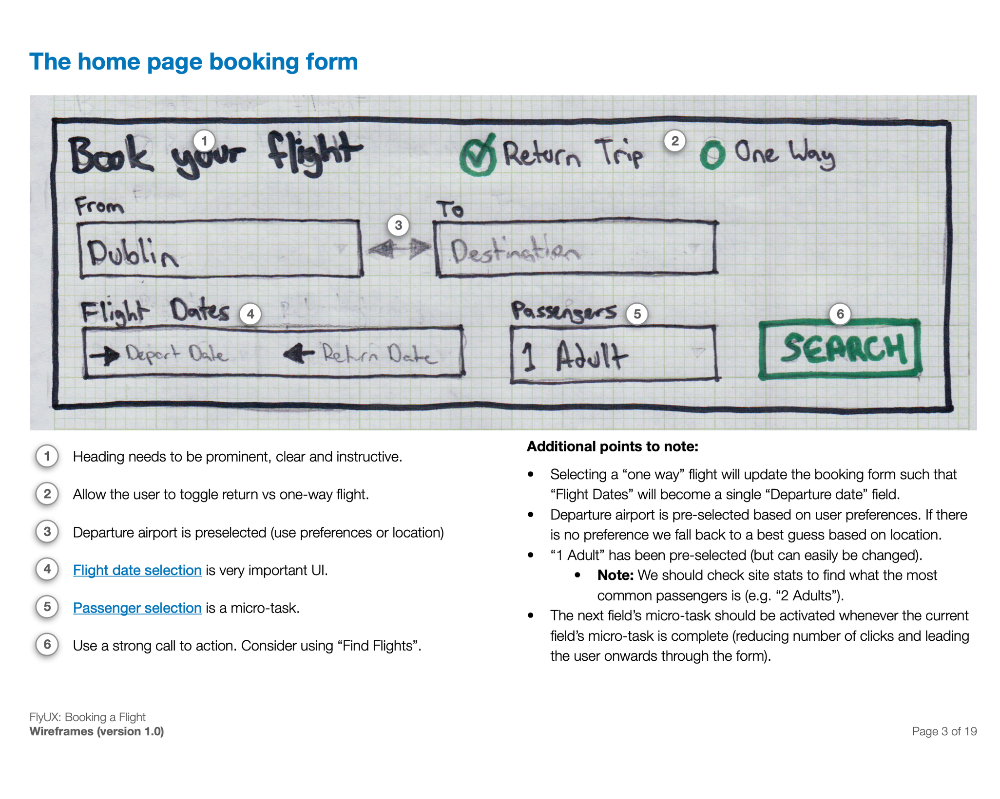
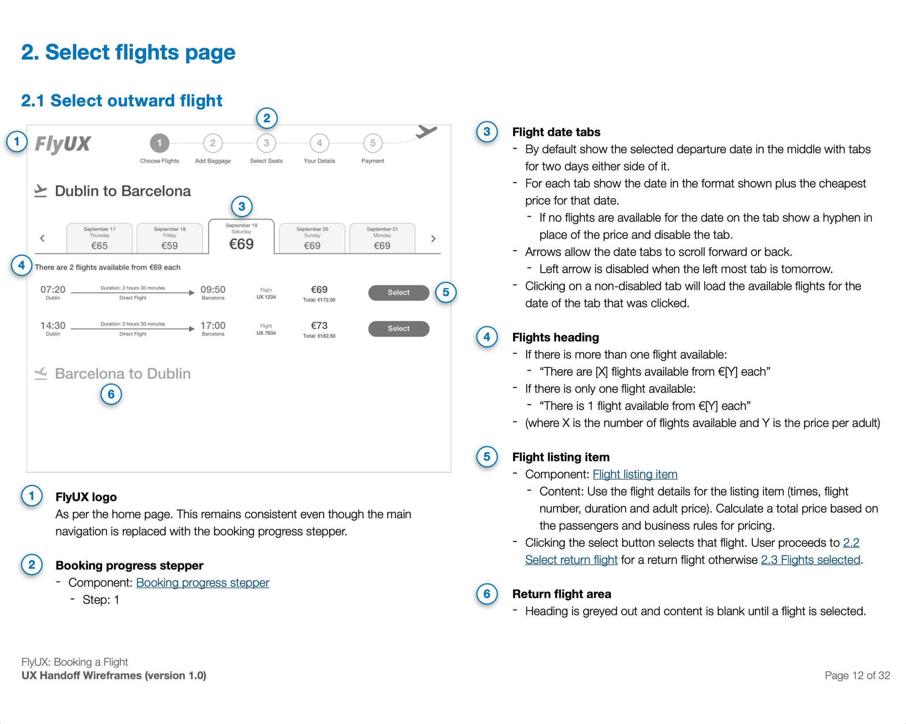

I recently completed a Professional Diploma in UX with the UX Design Institute. It was a great way to update
my skills and formalise
my understanding and experience of UX. I particularly appreciated the focus on user research and techniques
that can help distill useful design insights from qualitative data. 

<Gallery>

</Gallery>

The project work for the UX diploma was centred around developing a new flight booking system for Fly UX - 
a fictitious airline. The general approach for the project was as follows:

### 1. Research 

Research was conducted via two approaches. First I did a competitive analysis of a selection of airline booking
processes. Then I conducted an in-depth interview and usability test with a typical airline customer. The test 
involved writing an interview and test script, setting up the session, recording the one hour session
and then writing extensive notes about how it went.

### 2. Analysis

The competitive analysis, interview and usability test resulted in a large amount of raw qualitative data. The
next step was to distill that data down into insights that could inform the design decisions.

I conducted an **affinity diagram** exercise to help group the raw data together and visualise the outcomes.

<PDFLink path="/docs/FlyUX_AffinityDiagram.pdf" text="Fly UX Affinity Diagram" />

Next I took the outcomes of the affinity diagram and used them to help build a **customer journey map**. This helped
identify some pain points in the flight booking experience.

<PDFLink path="/docs/FlyUX_CustomerJourney.pdf" text="Fly UX Customer Journey" />

### 3. Design, prototype and validate

The first step of the design process was to use the research and analysis outcomes to develop a **flow diagram** 
for the booking process.

<PDFLink path="/docs/FlyUX_FlowDiagram.pdf" text="Fly UX Booking Process Flow Diagram" />

And from there I started to roughly **sketch out the screens and interactions** that would be required for the 
booking process.

<PDFLink path="/docs/FlyUX_WireframeSketches.pdf" text="Fly UX Booking Process Sketches" />

Next I built a **mid-fidelity prototype** with limited functionality using Sketch and Invision.

<ProjectLink
    text="View the prototype"
    url="https://pete877066.invisionapp.com/overview/FlyUX-Booking-Process-ckbrzfnnm02fn01406cta3oce/screens"
/>

I was able to use the prototype to do further usability testing - to confirm some of my design choices and make
adjustments where necessary.

### 5. Handover for build

The final step in this project was to flesh out some comprehensive and well-documented **wireframes**. The idea was
that these wireframes could be used as part of a handover process so that the new booking process could be built
(before being further tested and iterated upon).

<PDFLink path="/docs/FlyUX_HandoverWireframes.pdf" text="Fly UX Wireframes and Handover Documentation" />
