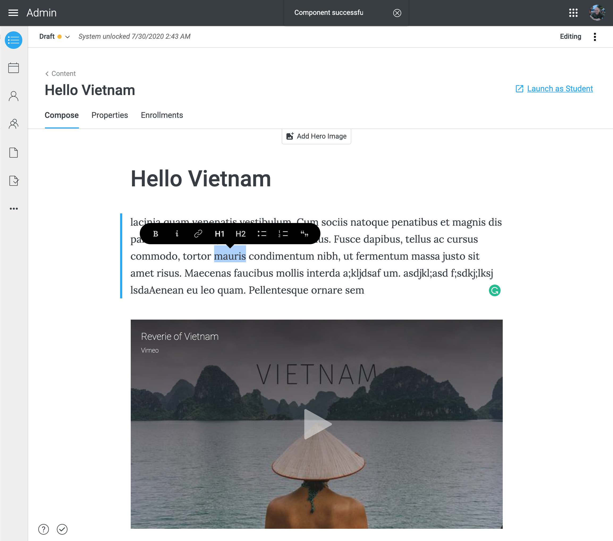
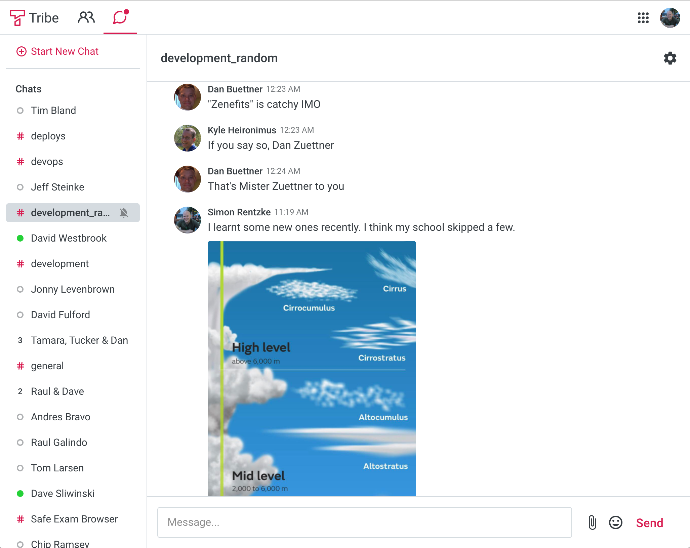
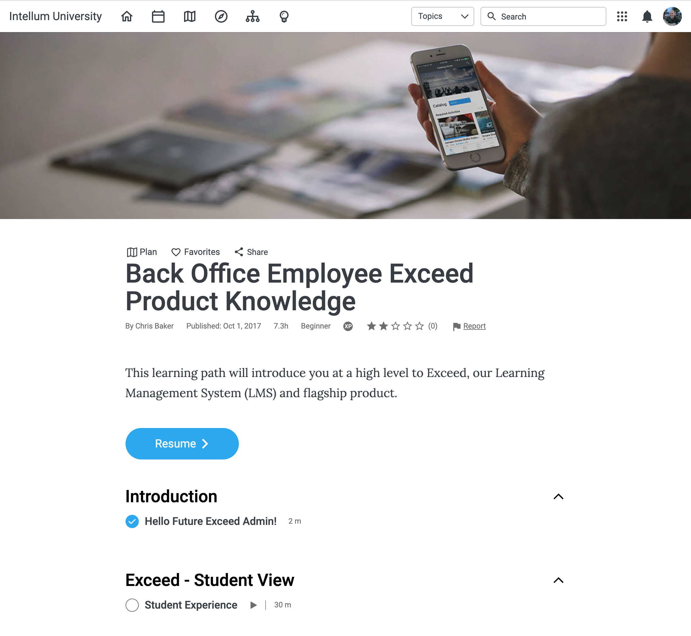
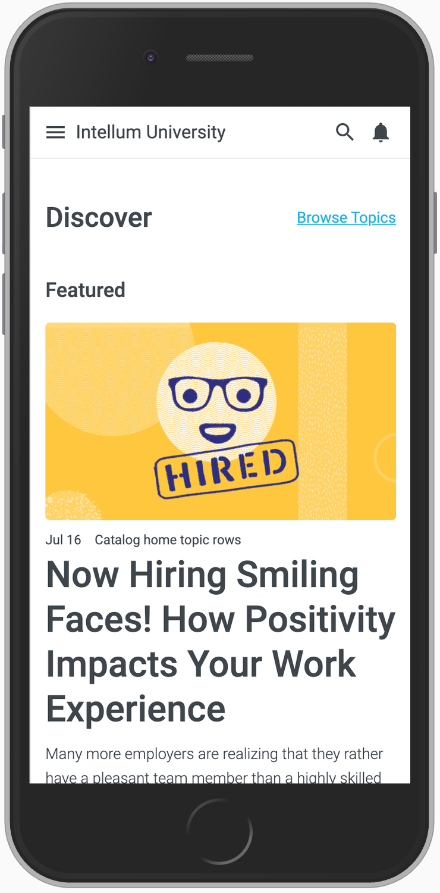
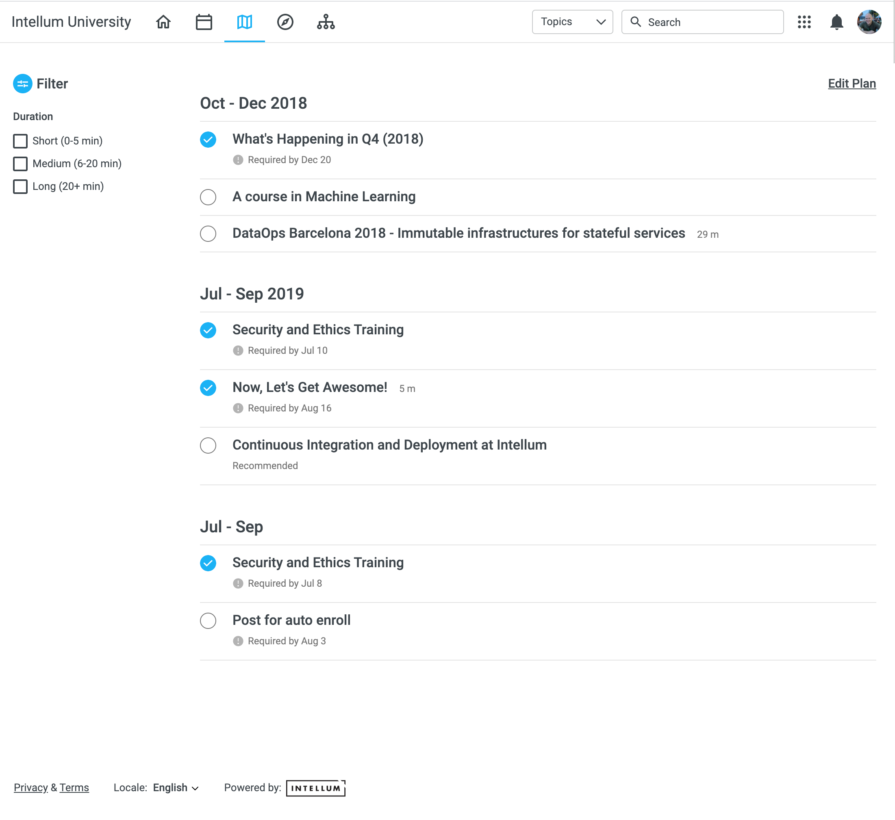

Intellum provide learning management solutions to a wide range of clients including Google, Facebook, 
Amazon, and Snapchat. I worked as a front-end engineer on a wide range of projects including Exceed
(Intellum's learning management system), Catcat (a public catalogue of learning material) and Tribe (a social
media application with chat facilities).

<Quote attributionText="Director of Engineering, Intellum">
    Pete is a superb talent with the ability to combine both exceptional technical and communication 
    skills. Pete led our front end team to transform our existing code base to a modern and high 
    quality product whilst simultaneously building large roadmap features.  He is a pleasure to work 
    with and takes deep care for the quality of his work.
</Quote>

<Gallery>

</Gallery>

### Some of the projects I worked on with Intellum

#### Learning planner

"My plan" is a feature in Exceed LMS that enables the building out of a personalised learning plan. Required
and elected learning material can be scheduled and managed collaboratively by users and their managers.

#### Content editing

I helped implement a simplified WYSIWYG content editor for building out learning the content. The editor UI is
based on the document editing approach popularised by Medium.

#### Tribe Chat

Tribe Chat is a fully featured and complete chat facility. It works as a standalone product but it can also be 
integrated into Intellum's learning environment. I led the build of the front-end for the chat application
using React and Redux. 

#### Catcat

[Catcat](https://www.catcat.com/) is a public catalogue of learning material developed by Intellum. This
project included a full redesign and customisation of the LMS as well as the introduction of a new
curation system (allowing for the curation of submitted learning content).

#### General feature development and support

Exceed has a large and continually growing set of features that need to be maintained at a high level of 
quality, maintainability and accessibility. As such the front-end required continual upgrading, development 
and support.

#### Gradual modernisation of the front-end codebase
 
Exceed is built as a traditional server-side rendered app using Ruby on Rails. I led an initiative to help 
modernise the front-end codebase. The challenge was to work within the constraints of the existing architecture 
such that new features could continue to be built without the downtime that would be required for a complete 
rebuild. To meet this challenge I reduced the use of JQuery and gradually introduced ES6 via Webpack, Custom 
Elements and Web Components. I set up a testing framework so that all new JavaScript code could be properly 
tested. I helped document CSS and JavaScript coding guidelines and set up documentation for a
component library. The overall intention of these measures was to develop a shared mindset that could help
us transition to a more modern architecture using a JavaScript framework like React.

### Technology I used

* JavaScript, HTML and CSS/SCSS
* Webpack
* Custom Elements, Web Components and Polymer
* React and Redux
* Mocha and Jest
* Ruby on Rails
* Storybook