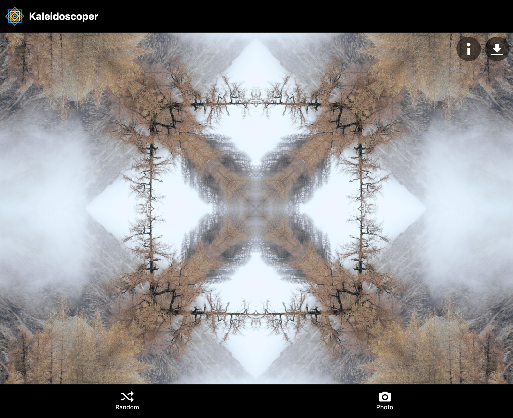
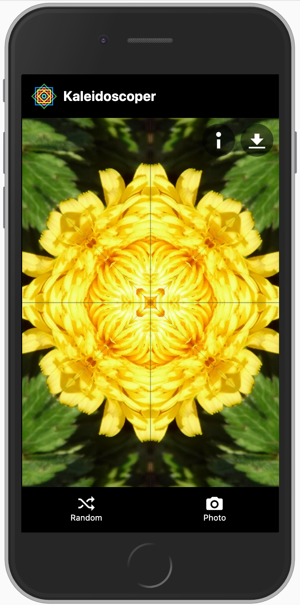
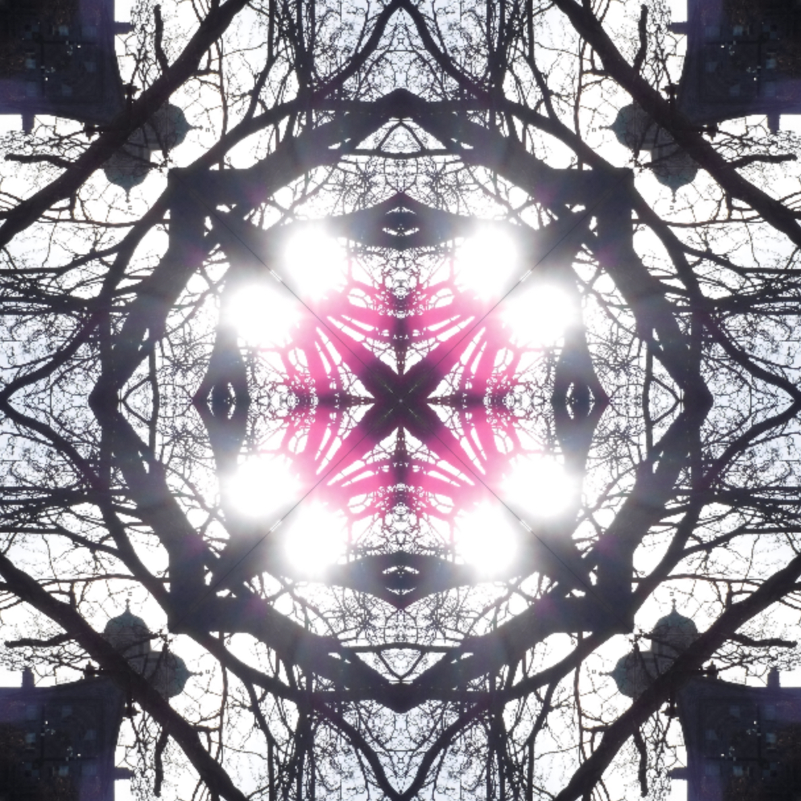

I always wanted a kaleidoscope as a child... so eventually I built one as a progressive web app 
using HTML Canvas. By default, Kaleidoscoper takes random public images from [Unsplash](https://unsplash.com/) 
(via [Lorem Picsum](https://picsum.photos/)). You can also load in photos from the local file system 
or camera.

<ProjectLink url="http://kaleidoscoper.com/" />

<Gallery>

</Gallery>

### Technology

* HTML5 Canvas
* React
* TypeScript
* Tailwind CSS
